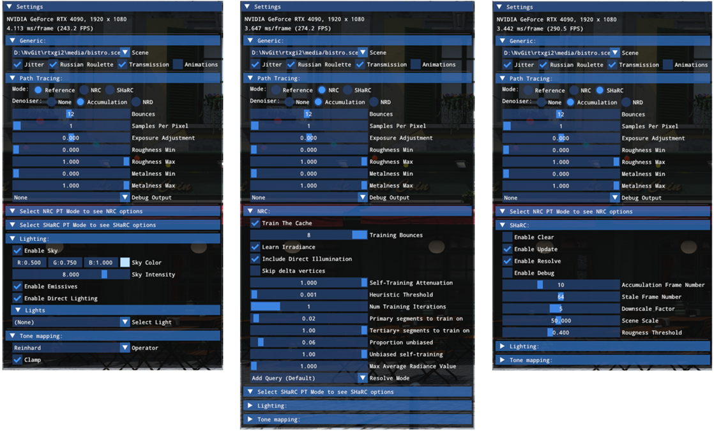

# Quick Start Guide

This document lists the necessary steps to get up and running with the RTXGI SDK pathtracer sample showcasing an example integration of the NRC and SHaRC libraries in a simplified unidirectional Monte Carlo path tracer. 

For programming/integration guides specific to each technique, see the individual [NRC][NrcGuide] and [SHaRC][SharcGuide] guides.

## Build steps
Assuming the tools specified in the [prerequisites][Prereq] section are available:

1. Clone the project recursively to a preferred location for the `local-repo-path` field:
    ```
    git clone --progress --recursive --branch main -v "https://github.com/NVIDIAGameWorks/RTXGI.git" "local-repo-path"
    ``` 

2. Configure and then generate the solution using CMake GUI (or the CLI). The `source` directory should be the root of the repository and `build` directory should be a new directory located in the repository root.

3. The newly generated solution `rtxgi2_samples.sln` should be located in the `build` directory. Open it and run the `pathtracer` project. Optionally, use the debug command line argument `-vk` to run the NVRHI Vulkan rendering backend version. 

## The pathtracer sample
This showcases an elementary path tracer that relies on either NRC or SHaRC to terminate early into the respective radiance/irradiance cache for an improved signal.



**Generic settings.** New scenes can be loaded from here via a JSON file that specifies GLTF assets and user-defined properties for common constructs such as lights and camera. Additionally, four more settings that affect the pathtracer and either of the radiance caching techniques can be toggled here.

**Path tracing settings.** This section addresses typical pathtracer settings such as the number of bounces, samples per pixel, a global dial for altering material properties, and a list of debug views that ensure the scene data is correctly represented (normals, worldspace positions, etc.). From this panel, the radiance/irradiance caching modes as well as the denoising modes can be selected.

**NRC settings.** In this section, NRC can be toggled, fine-tuned, as well as debugged visually via the `Resolve Mode`. For further details see the [in-depth NRC guide][NrcGuide].

**SHaRC settings.** These provide a way to toggle the tech, manually invoke a clearing of the cache, fine-tune factors that contribute to the hash-grid data, as well as visually inspect the direct contents of the cache via the `Enable Debug` option. For further details see the [in-depth SHaRC guide][SharcGuide].

**Lighting.** This section allows for modifying the initial light data specified in the JSON scene file.

**Tone mapping.** Post processing section that currently only accounts for tone mapping - useful for clamping radiance values.

[NrcGuide]: NrcGuide.md
[SharcGuide]: SharcGuide.md
[Prereq]: ../Readme.md/#prerequisites
